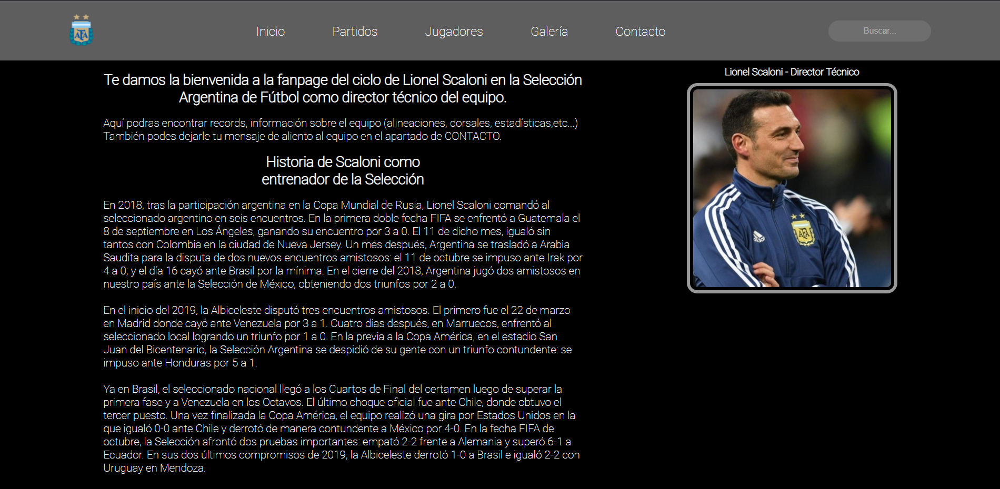

# Scaloneta
Proyecto Final para Curso de Coder House

## Contenido
Este proyecto esta basado y referido en Lionel Scaloni, actual DT de la selección nacional Argentina de fútbol.

## Estructura del proyecto
El proyecto esta estructurado y diseñado con HTML, CSS y SASS. Cuenta con 5 páginas HTML todas ellas tienen estilos definidos con CSS y SASS.

## Instalación
Para instalar y correr el proyecto escriba y ejecute
```bash
npm install
``` 
## Vista anticipada
Preview del sitio web

